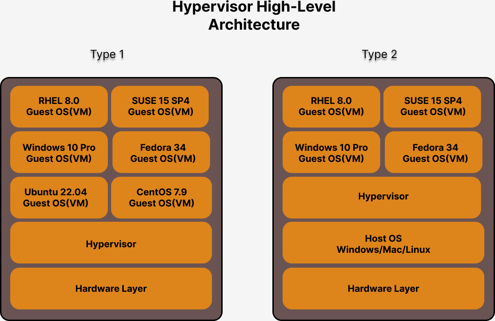
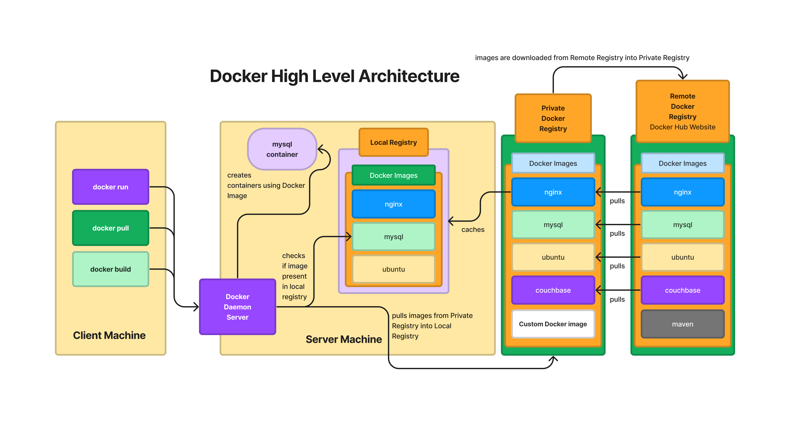
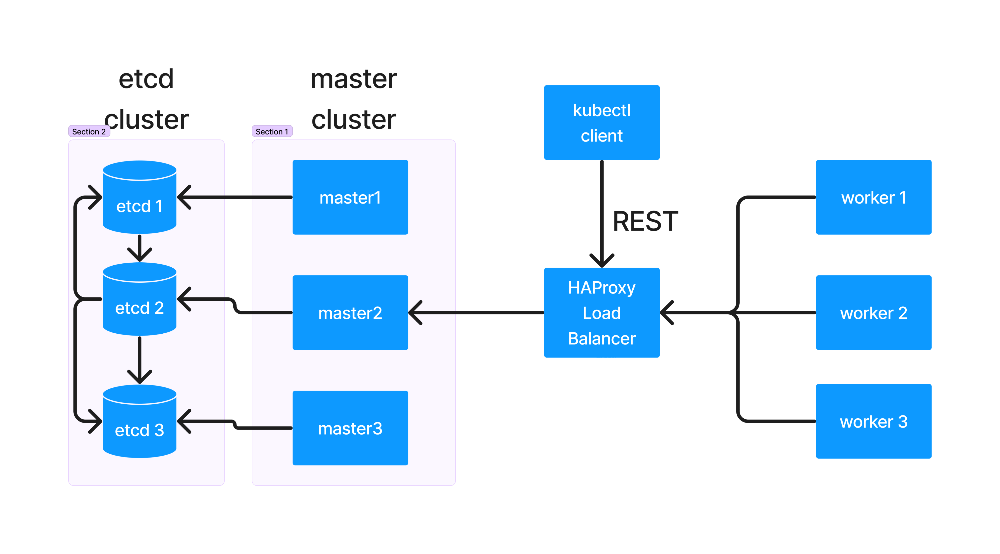
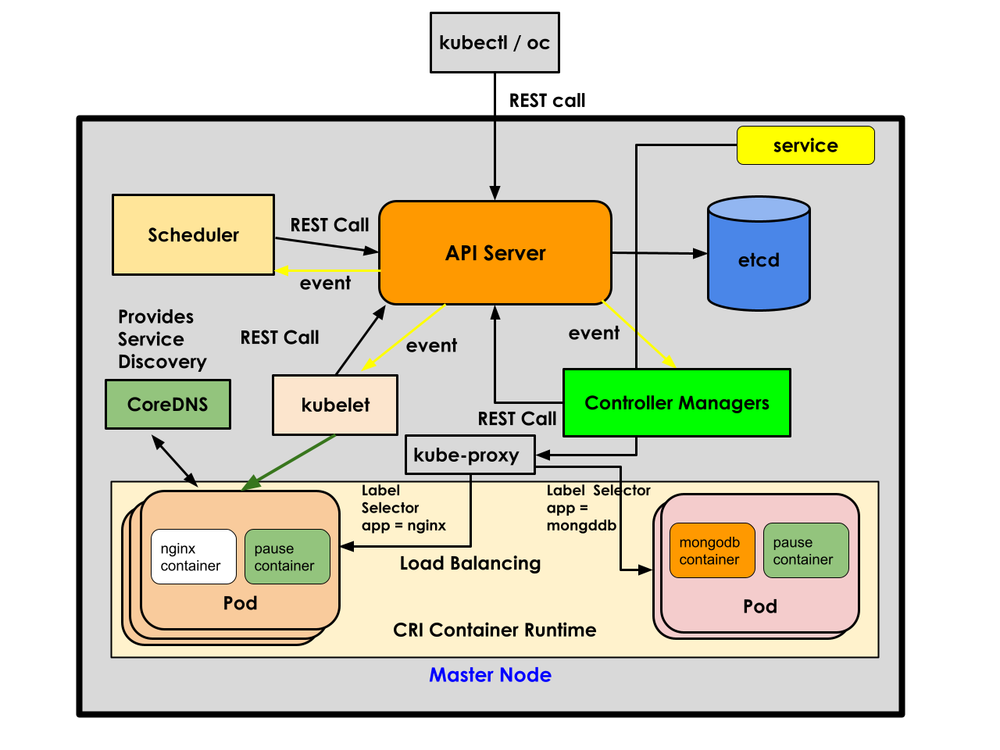
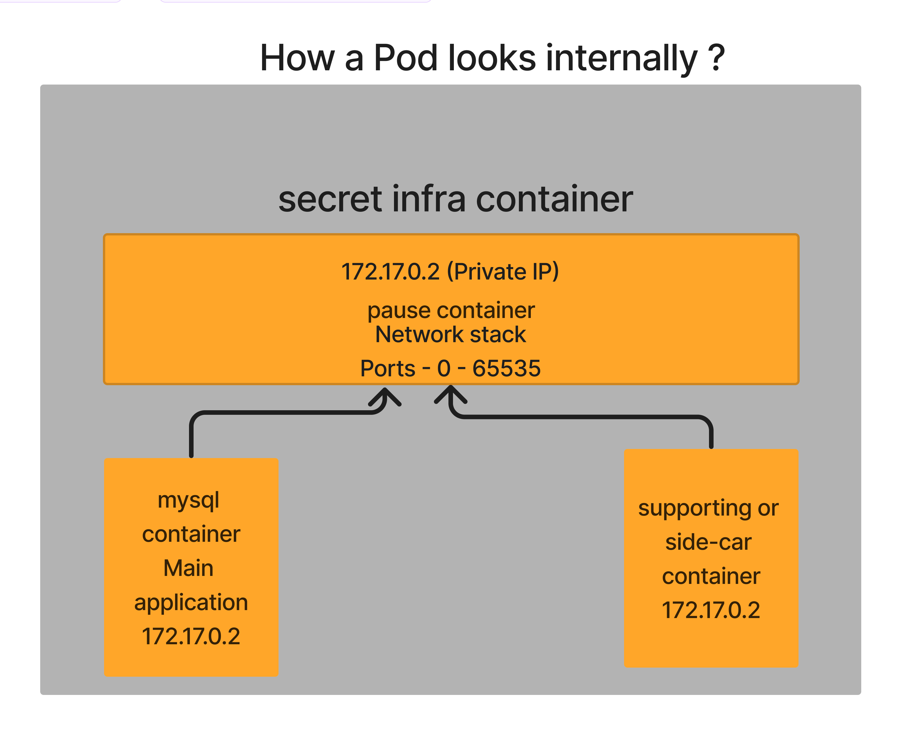

# Day 1

# Before Virtualization was available,how we can install two or more Operating System in the same machine
<pre>
- Boot Loaders - is a system utility that helps us install many OS ( typically 2 to 4  per laptop/desktop )
- Only 1 OS can be active at any point of time
- We can't run more more 1 OS, it is impossible
- Examples of Bootloaders
  - LILO (Linux Loader)
    - is a very old boot loader that was used in older linux distributions
    - right now not used
  - GRUB 
    - is used by every Linux Distributions
    - supports booting Windows, Mac, Unix & Linux
    - is opensource
  - BootCamp
    - is a boot loader used to support windows on a Mac machine
</pre>  

## Processor
<pre>
- Processors comes in 2 types of Packaging
  - SCM 
    - Single Chip Module
    - one IC will have just one Processor
  - MCM 
    - Multiple Chip Module
    - one IC will have many Processors
- Each Processor may support many CPU Cores
  - 256 cores per Processor
  - 512 cores per Processor
  - 128 cores per processor
  - 64 cores per processor
- Server grade motherboards will support many Processor sockets
- assume a server motherboard support 4 Processor Sockets
- in each of those Processor Socket, if we install a MCM Processor with 4 Processor per IC
- in total how many Processor in the motherboard 16 Processors
- let's assume each Processor supporting 128 cores
- total cpu cores 128 x 16 = 2048 Physical CPU Cores
- For Hypervisors, they look for logical/virtual core
  - each Physical core supports 2 to 4 virtual cores, in a normal processor each physical core supports 2 logical/virtual core
  - how many logical cores Hypervisors will see 2048 x 2 = 4096 Logical/Virtual Cores

</pre>  

## Hypervisor Overview
<pre>
- is virtualization technology
- virtualization allows us running many OS paralelly side by side in the same laptop/desktop/workstation/server
- there are types of Hypervisor
  1. Bare Metal Hypervisor aka Type1 
     - Used in Servers/Workstations
     - Examples
       - VMWare ESXi/VMWare vSphere
       - KVM ( works in all Linux distributions )
  2. Type 2 
     - Used in Laptops/Desktops/Workstations
     - Examples
       - VMWare Wokstation ( Windows & Linux )
       - VMWare Fusion ( Mac OS-X )
       - Hyper-V ( Windows )
       - Parallels( Mac OS-X )
- Each Virtual Machines that runs on top of Hypervisor, will allocated with dedicated
  - CPU Cores ( Logical or Virtual Cores )
  - RAM 
  - Storage
  - Virtual Network Card
  - Virtual Graphics Card
- Each Virtual Machine(VM - aka Guest OS) represents one fully functional Operating System
- This type of virtualization is called Heavy weight Virtualization, the reason being each VM requires dedicated hardware resources
</pre>

## Info - Hypervisor High Level Architecture

## Container Technology
<pre>
- an application virtualization technology
- each container represents one application process
- containers are not Operating system
- container may resemble like a VM or an OS in certain ways but they are just application process
- this type of virtualization is called lite-weight virtuatlization
- all the containers running on an OS shares the hardware resources available to the underlying OS
- every container is isolated by namespaces
  - container use port namespace
  - container use PID namespace
  - container use network namespace
- each container has its own network stack ( 7 OSI Layers )
- each container has its own software defined network cards (NIC)
- each container gets atleast one IP Address ( normally Private IP address )
- each container gets its own file system
- each containers gets its own port range - ( 0 to 65535 )
</pre>

## Info - Docker High Level Architecture

## Info - Container Runtime Overview
<pre>
- container runtime is a low-level software that can manage container images and containers
- example
  - runC
  - CRI-O
- container runtimes are not so user-friendly, hence normally no end-users use this directly
</pre>  

## Info - Container Engine
<pre>
- container engine is a high-level software than can manage container image and containers
- container engine depends on container runtime to manage container images and containers
- container engine provide user-friendly commands i.e without knowing the linux kernel lower level knowledge we can easily create and manage container and images
- examples
  - Docker
    - depends on containerd, containerd depends on runC container runtime internally
  - Podman
    - depends on CRI-O container runtime
</pre>  

## Info - High Availability (HA)
<pre>
- always the application should be up and running
- 
</pre>

## Info - Container Orchestration Platform Overview
<pre>
- manages containerized application workloads
- benefits of using Container Orchestration Platforms
  - it provides an environment and all required features to make your application High Available
  - scaling up/down of containerized application workload is possible based on user traffic
  - rolling update 
    - upgrading your live application from one version to the other without any downtime
  - they support inbuilt monitoring features to heal your application they become unresponsive or faulty
  - container orchestration platforms they also self-heal some of their components goes unresponse or faulty
- examples
  - Docker SWARM
  - Kubernetes
  - Red Hat Openshift
</pre>

## Info - Docker SWARM
<pre>
- is a docker's native container orchestration platform
- it only supports managing docker containers
- it is light-weight, very helpful for learning purpose, R&D, Dev/QA environment
- it is not production grade, hence rarely used in production
</pre>

## Info - Kubernetes
<pre>
- is a container orchestration platform from Google
- it is opensource
- it supports many different types of container runtime/engines
- it is production grade
- though it supports minimal Dashboard(Web interface), the Web interface poses many security issues compared to advantages, hence it is considered only as a command-line tool
- Kubernetes supports extending its REST API or features by defining new Resources using Custom Resource Definitions
- to manage your Custom Resource, we also need to develop custom operators, this way we can add additional functionalities on top of Kubernetes
- intially both Kubernetes and Openshift was supporting docker as the default container engines, but later docker support was removed
- Public cloud vendors support managed service
  - eks - Elastic Kubernetes Service ( PaaS )
  - aks - Azure Kubernetes Service ( PaaS )
</pre>

## Info - Kubernetes High Level Architecture

## Info - Red Hat Openshift
<pre>
- Red Hat Openshift is developed on top of Google Kubernetes
- Using the Kubernets Custom Resource and Custom Operators, Red Hat Openshift team has added many new features on top of Kubernetes
- Red Hat Openshift comes with batteries included
- Red Hat Openshift comes its internal container registry  
- Red Hat Openshift also supports many features
  - Routes to expose your application with a friendly url
  - Web Interface
  - Role Based Access Control, User management
  - CI/CD 
- Public cloud Managed Openshift Service
  - AWS ROSA
  - Azure ARO
- Starting Red Hat Openshift 4.x, docker support was removed
- Starting from Red Hat Openshift 4.x, Openshift only supports Podman Container Engine with CRI-O Container Runtime
- Starting from Red Hat Openshift 4.x onwards, OpenShift only supports Red Hat Enterprise Core OS (RHCOS) as the operating system for Red Hat Openshift Master nodes
- Starting from Red Hat Openshift 4.x onwards, OpenShift supports two OS, i.e either Red Hat Enterprise Linux (RHEL) or Red Hat Enterprise Core OS (RHCOS) as the operating system for Red Hat Openshift Worker nodes
- However, Red Hat Openshift recommned using RHCOS Operating System in Master and Worker Nodes
</pre>

## Info - Red Hat Openshift High Level Architecture

## Kubernetes/Openshift Master Nodes
<pre>
- Supports a special set of components called Control Plane Components
- they could even be an ec2 instance in AWS or Azure VMs or an on-prem VM
- Control Plane Components
  1. API Server
  2. etcd 
  3. scheduler
  4. controller manager(s)
- control plane components runs only in master nodes
- control plane components are the ones which support the container orchestration features
- Every production grade Openshift supports atleast 3 master nodes
- By default, only control planes components will be deployed on master nodes, however it is possible to configure master nodes to allow deploying user applications as well
</pre>

## Kubernetes/Openshift Worker Nodes
<pre>
- worker node could be a physical server or a virtual machine
- they could even be an ec2 instance in AWS or Azure VMs or an on-prem VM
- This is where user application container workloads runs or deployed
</pre>  

## Kubernetes/Openshift Cluster
<pre>
- a group of servers/nodes that form a Kubernetes/Openshift cluster
- kubernetes/openshift comes with client tools
  - kubectl - is a kubernetes client tool which helps us interact with Kuberntes/Openshift cluster
  - oc - is an openshift client tool that helps us to interact with Openshift cluster
  - both kubectl and oc depends on a kubeconfig file kept in your home directory /home/jegan/.kube/config ( in your case /home/user01/.kube/config )
  
</pre>  

## Info - Pod Overview
<pre>
- a group of related containers
- each Pod has a secret hidden infra-container called pause container
- the pause container provides network features
- the application container that runs in the Pod is connected to the pause container network
- this is how, all the containers running in the same Pod shares the same IP address
</pre>

