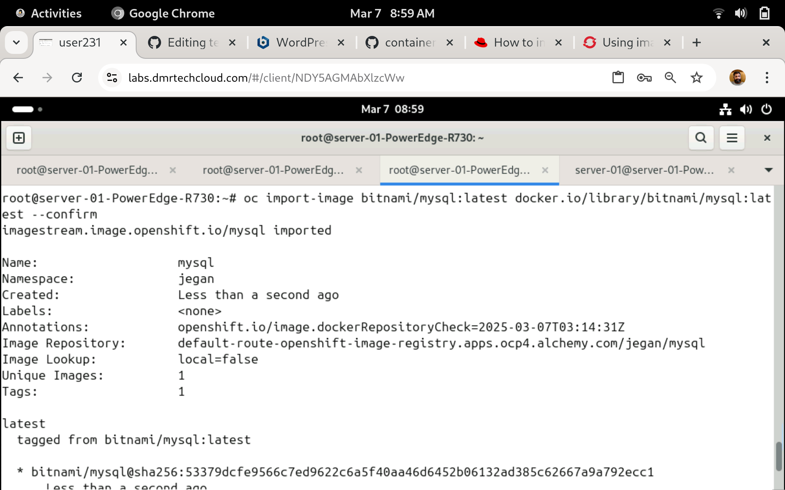

# Day 5

## Demo - Importing docker image from Docker Hub Repository to Openshift's Internal registry ( Kindly avoid importing additional images to avoid exhausting the docker limit )
```
docker login

oc create secret generic docker-pullsecret --from-file=.dockerjsonfile=/root/.docker/config.json --type=kubernetes.io/dockerconfigjson

oc import-image bitnami/nginx:latest bitnami/nginx:latest docker.io/library/bitnami/nginx:latest --confirm

oc get images
```

Expected output





For more details, you may also refer official documentation here
<pre>
https://access.redhat.com/solutions/2072843  
</pre>

## Lab - Deploying application into Openshift using docker strategy
<pre>
- In case of docker strategy, openshift will expect for Dockerfile in your GitHub repository.  
- Openshift will use the Dockerfile to perform the application and image build.
</pre>

```
oc project jegan
oc new-app https://github.com/tektutor/hello-microservice.git --strategy=docker
```

## Lab - Deploying application into Openshift using source strategy
<pre>
- In case of source strategy, openshift will not expect you to provide Dockerfile in your GitHub repository. 
- Even if there is Dockerfile in the repository, Openshift will generate a Dockerfile with the image name you suggested in the oc new-app command.  
- Openshift will use the Dockerfile to perform the application and image build.
</pre>


```
oc project jegan
oc new-app --name=hello https://github.com/tektutor/hello-microservice.git --strategy=source
```

Expected output


